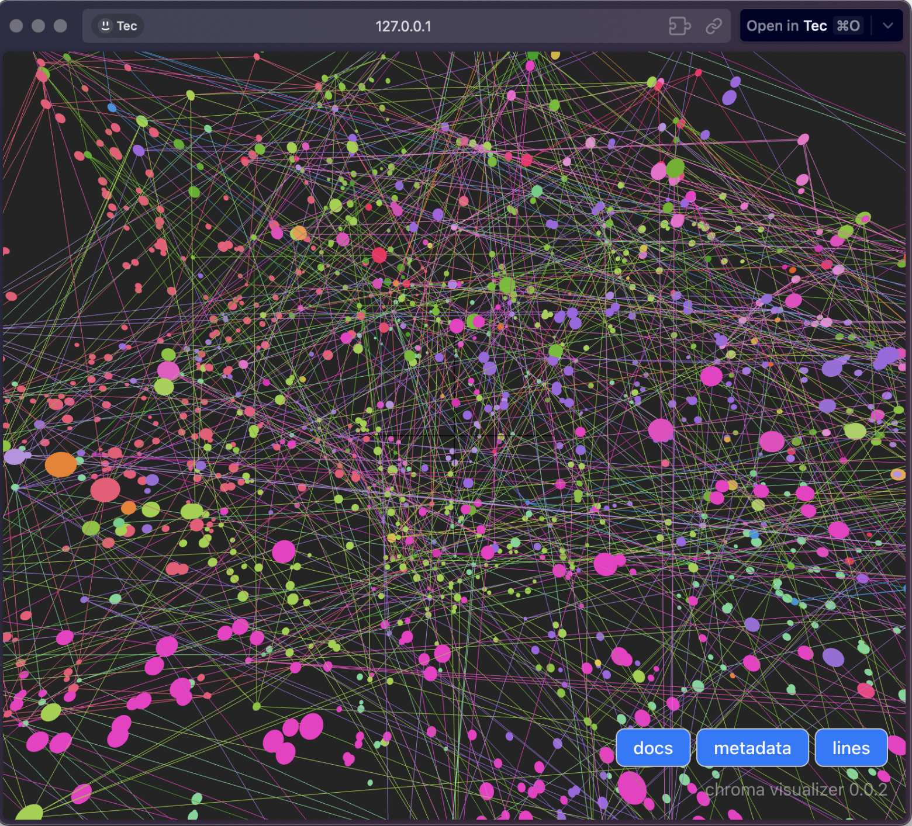

# Alejandria AI: Enhancing PDF Interaction with Advanced AI

## Project Overview

Alejandria AI is an innovative software solution developed during the HackMTY 2023 Hackathon, where it received a Softtek Honorific Mention. This project was designed to revolutionize the way we interact with PDF documents by leveraging cutting-edge AI technologies for efficient PDF-to-vector conversion and precise answer selection. The core objective of Alejandria AI is to bridge the gap between static PDF content and dynamic information retrieval, enabling users to extract and visualize data in an unprecedented manner.

## Purpose

The primary purpose of Alejandria AI is to facilitate seamless access to information contained within PDF documents, making it significantly easier for users to find answers to their questions. By converting PDF content into vectors and employing advanced AI algorithms, Alejandria AI provides precise and contextually relevant answers, enhancing research efficiency and knowledge acquisition.

## Key Features

* PDF-to-Vector Conversion: Utilizes Meta's Lama LLM technology to transform traditional PDF content into vector representations, enabling sophisticated semantic searches and data manipulation.
* Precise Answer Selection: Implements Meta's Lama LLM for indexing and meticulous source citing, ensuring that the retrieved information is both accurate and verifiable.
* Vectorial Visualization: Incorporates Chroma for the vectorial visualization of PDF content, allowing users to visually comprehend the relationships between their queries and the document's information.
* Customizable AI Integration: Tailors Softtek's LLM to meet specific company needs, ensuring seamless integration and optimal performance within various operational contexts.

## Technology Stack

### Natural Language Processing:
* LangChain: Utilizes Meta’s Lama LLM for semantic searches and advanced text analysis.

### AI & Chatbot Integration:
* OpenAI: Enhances user interaction with chatbot functionality for dynamic question-answering.

### Programming Language:
* Python: Chosen for its versatility, efficiency, and extensive AI & data processing capabilities.

### Vector Data Management:
* Chroma: Manages vectorized data for efficient retrieval, indexing, and visualization.

## Contribution 

### To Sofftek
Alejandria AI optimizes workflows, enhances knowledge management, and improves customer support through Softtek’s LLM, delivering tailored, AI-driven solutions.

### To other companies 
Alejandria AI enables precise data retrieval, boosts productivity, and transforms static documents into actionable insights with customizable AI tools.

## Conclusion

Alejandria AI represents a significant leap forward in how we interact with and understand the content within PDF documents. By harnessing the power of advanced AI technologies, this project not only simplifies information retrieval but also paves the way for innovative data visualization and analysis methods. Whether for academic research, professional documentation, or personal use, Alejandria AI offers a transformative tool that enhances our ability to access and engage with knowledge.

## NOTES
- please download `ggml-model-gpt4all-falcon-q4_0.bin` from [here](https://gpt4all.io/index.html) and put it in the root of the ai folder

    

## Team

    

